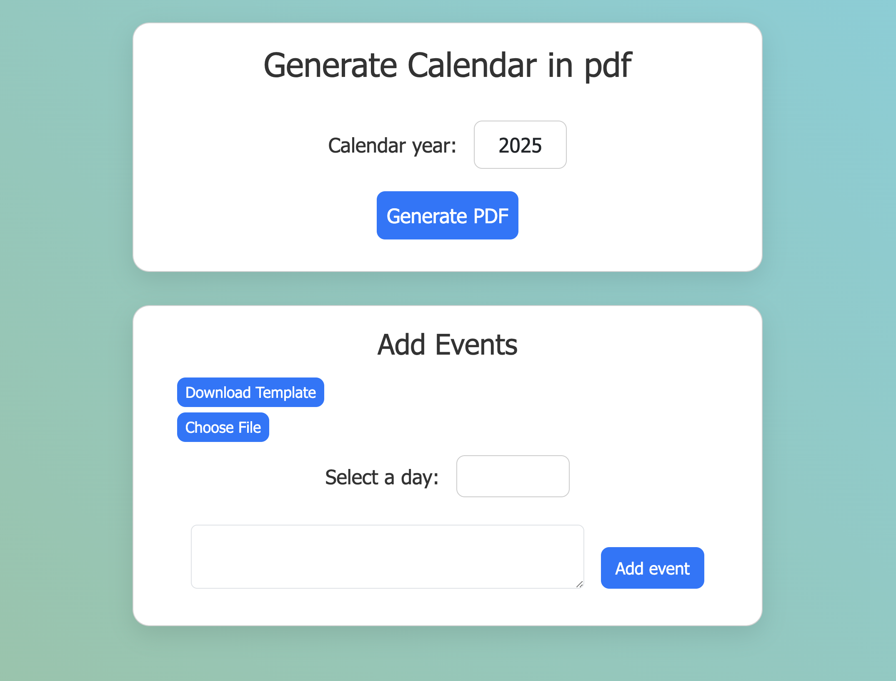
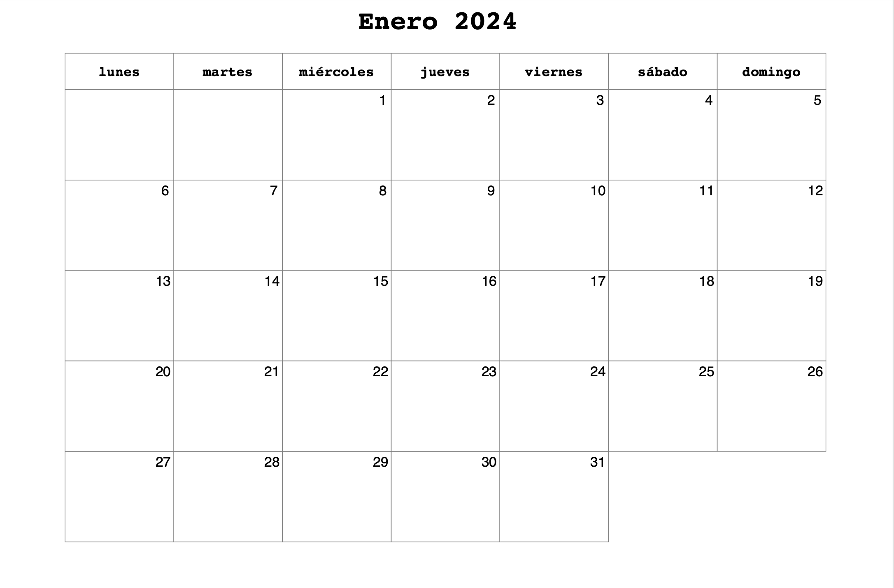
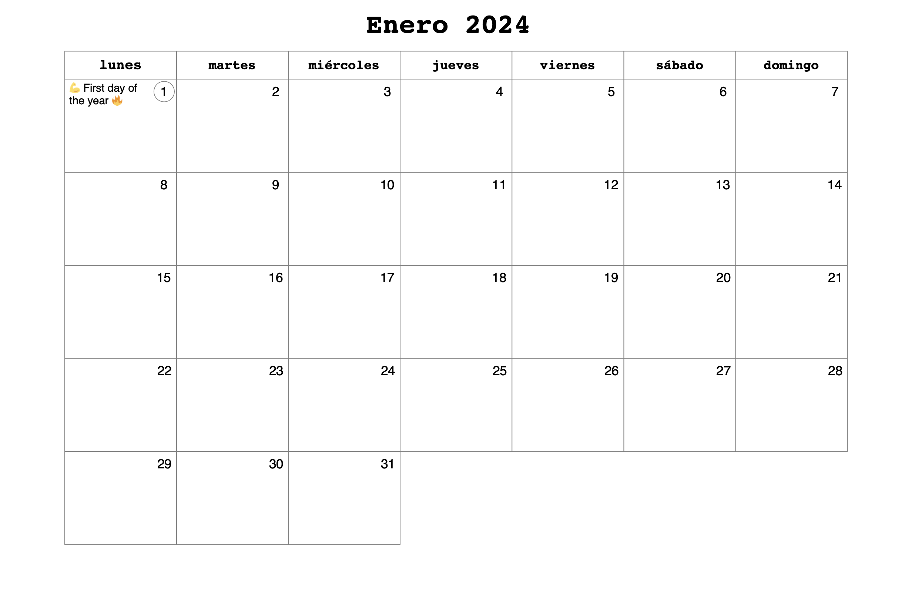

# Generate Calendar

## Descripción 📄

Every year I have to look for a calendar to print out, since I like to organize myself that way. This year I decided that instead of wasting time looking for it, I was going to create it myself, so I made this project to generate the annual calendar by months. Just enter the year you want, and it will generate the calendar for that year.

### Deploy 🔥
```
https://generate-calendar.onrender.com/
```

In the page, to generate the calendar, put the year and the different events if you want it. Also, you can download a template to add the events and import this file with them to get it dynamically.



## Instalation local 🚀

Follow these steps to install and run the project:

1. Clon the repository:
   ```bash
   git clone https://github.com/Rafael3994/generate-calendar.git
   ```

2. Go to the folder and install the depencencies.
   ```bash
   cd generate-calendar
   npm install
   ```

3. Set the command to run the project and the year you want to generate the calendar.
    ```bash
   npm run start {year}
   ```




1. Add events to the calendar using a string in the command. In the name of the event, you can use emojis.
    ```bash
   npm run start {year} '["{day}/{month}/{name_event}"'

   example:  npm run start 2024 '["1/1/💪 First day of the year 🔥"]'
   ```


## Author 👑
Rafael Garcia Perez
[GitHub - Rafael3994](https://github.com/Rafael3994)
[Linkedin - Rafael3994](https://www.linkedin.com/in/rafael3994/)